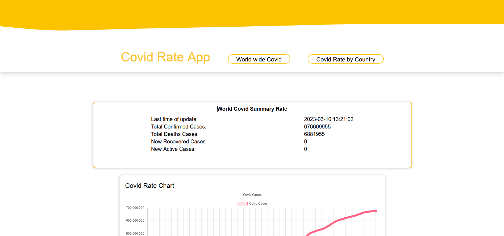

# CovidRateApp V0.7
CovidRateApp allows you to observe the Covid cases of diferent status in each country or in the world

## Table of data around the world 


Main screen of website represents a table with few lines of world wide covid rate. 
Information that represents in table is getting from [Covid19 API](https://covid19api.com/) 

## Custom settings page


This page provides to user the ability of choosing country, date and status for searching covid cases information more accurately.
Also Up to date filter is included into functionality.

### Running  

To run this project, install it locally cloning repo than  using npm:
```
> cd ./covid-rate
> npm start
```

* You should have node_js installed locally to run this app.

### Version:
* V0.1 [First version - first deploy]
* V0.2 [TailwindCSS was added]
* V0.3 [New Custom Page design]
* V0.4 [updated API]
* V0.5 [Charts added]
* V0.6 [New design added]
* V0.7 [Current]

