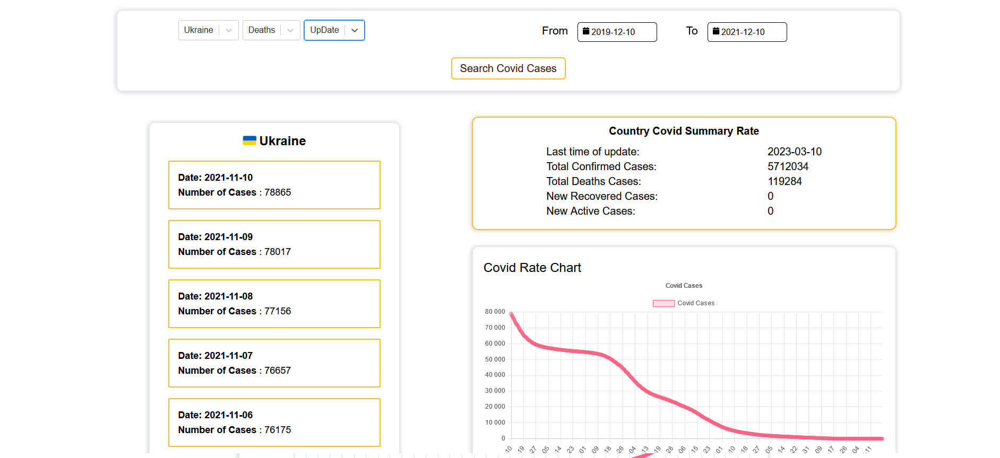

# CovidRateApp V0.7
CovidRateApp allows you to observe the Covid cases of diferent status in each country or in the world
Currently CovidRate is desktop only application.

## Life Demo


## Table of data around the world 


Main screen of website represents a table with few lines of world wide covid rate. 
Information that represents in table is getting from [Covid19 API](https://covid19api.com/) 
Last date of updating is provided as well as information charts bellow the table.


## Custom settings page


This page provides to user the ability of choosing country, date and status for searching covid cases information more accurately.
Also  Date filter is included into functionality. With V0.4 was included new GENERAL filter that provides more detail information about covid status 
for each country

## General settings


### Running  

To run this project, install it locally cloning repo, than using npm:
```
> cd ./covid-rate
> npm install
> npm start
```

### Version:
* V0.1 [First version - first deploy]
* V0.2 [TailwindCSS was added]
* V0.3 [New Custom Page design]
* V0.4 [updated API]
* V0.5 [Charts added]
* V0.6 [New design added]
* V0.7 [Current]

